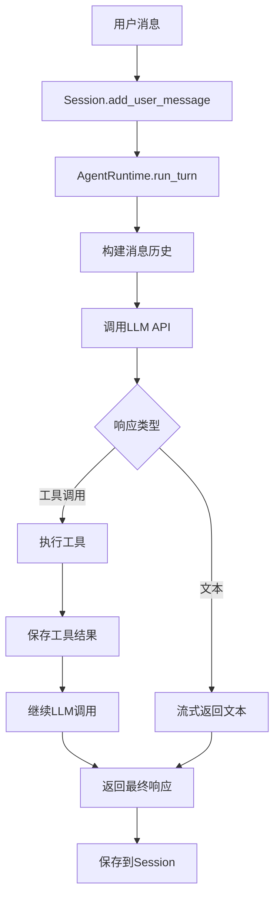

# Agent实现说明

## 📋 概述

ClawdBot Python使用**自研的Agent Runtime**实现，而不是依赖外部Agent框架（如Pi Agent）。

---

## 🏗️ 架构设计

### 核心组件

```
clawdbot/agents/
├── runtime.py        # Agent运行时核心
├── session.py        # 会话管理
└── tools/           # 工具系统
    ├── base.py      # 工具基类
    ├── bash.py      # Bash工具
    ├── file_ops.py  # 文件操作
    ├── web.py       # Web工具
    ├── browser.py   # 浏览器工具
    ├── image.py     # 图像生成
    └── ...          # 24个工具
```

---

## 🔧 Agent Runtime

### 1. AgentRuntime类

```python
class AgentRuntime:
    """Agent运行时 - 执行LLM对话并调用工具"""
    
    def __init__(self, model: str, api_key: Optional[str] = None):
        self.model = model  # 支持 anthropic/claude-* 或 openai/gpt-*
        self.api_key = api_key
```

**功能**:
- 管理与LLM的交互（Anthropic Claude 或 OpenAI）
- 流式响应处理
- 工具调用协调
- 多轮对话管理

### 2. 核心方法

```python
async def run_turn(
    self,
    session: Session,
    message: str,
    tools: Optional[list[AgentTool]] = None,
    max_tokens: int = 4096
) -> AsyncIterator[AgentEvent]:
    """
    执行一轮Agent对话
    
    流程:
    1. 添加用户消息到会话
    2. 构建消息历史
    3. 调用LLM API（流式）
    4. 处理工具调用
    5. 返回响应事件流
    """
```

### 3. 支持的LLM

| Provider | 模型示例 | 状态 |
|----------|---------|------|
| Anthropic | claude-opus-4-5-20250514 | ✅ 完全支持 |
| OpenAI | gpt-4o, gpt-4-turbo | ✅ 完全支持 |

---

## 📝 Session管理

### Session类

```python
class Session:
    """管理单个对话会话"""
    
    def __init__(self, session_id: str, workspace_dir: Optional[Path] = None):
        self.session_id = session_id
        self.messages: list[Message] = []
        self.session_dir = workspace_dir / session_id
```

**功能**:
- 消息历史持久化（JSONL格式）
- 多轮对话上下文
- 工具调用记录
- 会话状态管理

**存储位置**: `~/.clawdbot/sessions/{session_id}/transcript.jsonl`

### Message类型

```python
class Message:
    role: str              # "user", "assistant", "tool"
    content: str           # 消息内容
    timestamp: str         # ISO时间戳
    tool_calls: Optional[list]  # 工具调用
    tool_call_id: Optional[str] # 工具结果ID
```

---

## 🛠️ 工具系统

### AgentTool基类

```python
class AgentTool(ABC):
    """所有Agent工具的基类"""
    
    name: str              # 工具名称
    description: str       # 工具描述
    
    @abstractmethod
    def get_schema(self) -> dict:
        """返回JSON Schema"""
    
    @abstractmethod
    async def execute(self, params: dict) -> ToolResult:
        """执行工具"""
```

### 已实现的24个工具

1. **文件操作**
   - `read_file` - 读取文件
   - `write_file` - 写入文件
   - `edit_file` - 编辑文件

2. **Shell操作**
   - `bash` - 执行shell命令

3. **Web工具**
   - `web_fetch` - 获取网页
   - `web_search` - 搜索（DuckDuckGo）

4. **浏览器**
   - `browser` - Playwright浏览器控制

5. **消息/通道**
   - `message` - 发送消息
   - `telegram_actions` - Telegram操作
   - `discord_actions` - Discord操作
   - `slack_actions` - Slack操作
   - `whatsapp_actions` - WhatsApp操作

6. **高级功能**
   - `apply_patch` - 应用代码补丁
   - `image` - 图像生成
   - `canvas` - Canvas交互
   - `nodes` - 节点图
   - `cron` - 定时任务
   - `tts` - 文本转语音
   - `voice_call` - 语音通话
   - `process` - 进程管理

7. **会话管理**
   - `sessions_list` - 列出会话
   - `sessions_history` - 会话历史
   - `sessions_send` - 发送到会话
   - `sessions_spawn` - 创建会话

---

## 🔄 执行流程

### 完整的Agent对话流程



### 事件流

```python
AgentEvent类型:
- "lifecycle": {"phase": "start"}           # 开始
- "assistant": {"delta": {"text": "..."}}   # 文本流
- "tool": {"toolName": "...", "phase": "start"}  # 工具开始
- "tool": {"result": "...", "phase": "end"}      # 工具结束
- "lifecycle": {"phase": "end"}             # 结束
```

---

## 🆚 与Pi Agent对比

| 特性 | ClawdBot自研 | Pi Agent |
|------|-------------|----------|
| **依赖** | 无外部Agent框架 | 需要Pi Agent库 |
| **LLM支持** | Claude + OpenAI | 依赖Pi Agent支持 |
| **工具系统** | 自定义AgentTool | Pi Agent工具格式 |
| **流式响应** | 原生支持 | 取决于Pi Agent |
| **会话管理** | 自研Session | Pi Agent会话 |
| **灵活性** | 完全控制 | 受Pi Agent限制 |
| **维护** | 自主维护 | 依赖Pi Agent更新 |

---

## 💡 为什么自研？

### 优势

1. **完全控制** ✅
   - 不依赖外部框架
   - 可以自由定制
   - 快速响应需求

2. **轻量级** ✅
   - 只有核心功能
   - 无冗余依赖
   - 性能优化

3. **多LLM支持** ✅
   - 统一接口
   - 易于扩展新provider
   - 灵活切换

4. **工具系统** ✅
   - 自定义工具协议
   - 统一的工具接口
   - 易于添加新工具

### 代价

- ⚠️ 需要自行维护
- ⚠️ 功能相对简单（但够用）
- ⚠️ 没有Pi Agent的高级特性

---

## 📖 使用示例

### 基础使用

```python
from clawdbot.agents.runtime import AgentRuntime
from clawdbot.agents.session import Session
from clawdbot.agents.tools.bash import BashTool

# 创建运行时
runtime = AgentRuntime(
    model="anthropic/claude-opus-4-5-20250514",
    api_key="your-api-key"
)

# 创建会话
session = Session("my-session-id")

# 准备工具
tools = [BashTool()]

# 执行对话
async for event in runtime.run_turn(
    session=session,
    message="列出当前目录的文件",
    tools=tools
):
    if event.type == "assistant":
        print(event.data["delta"]["text"], end="")
    elif event.type == "tool":
        print(f"\n[工具: {event.data['toolName']}]")
```

### 与Gateway集成

```python
# Gateway自动处理:
# 1. Session管理
# 2. 工具注册
# 3. Channel消息转发
# 4. WebSocket通信

# 用户只需配置channel和发送消息即可
```

---

## 🔮 未来计划

### 正在追赶的功能

- [ ] 更多工具实现
- [ ] 更好的错误处理
- [ ] 工具执行超时控制
- [ ] 并行工具调用
- [ ] 工具执行沙箱
- [ ] 更丰富的事件类型
- [ ] 性能优化

### 可能添加的功能

- [ ] 支持更多LLM (Gemini, etc.)
- [ ] Agent间通信
- [ ] 工具权限控制
- [ ] 执行回滚
- [ ] 调试模式

---

## 📚 相关文档

- [README.md](README.md) - 项目概览
- [QUICKSTART.md](QUICKSTART.md) - 快速开始
- [ARCHITECTURE.md](ARCHITECTURE.md) - 架构设计

---

## ✅ 总结

### 当前状态

**Agent核心功能**: ✅ 已实现  
**工具系统**: ✅ 24个工具  
**会话管理**: ✅ 完整  
**LLM集成**: ✅ Claude + OpenAI  

### 与TypeScript版本对比

**架构**: 相似但独立实现  
**功能**: 正在追赶中（约80-90%）  
**工具数量**: 基本一致  
**稳定性**: 需要更多测试  

---

**版本**: 0.3.0  
**更新日期**: 2026-01-28  
**状态**: 🚧 核心功能完成，持续改进中
